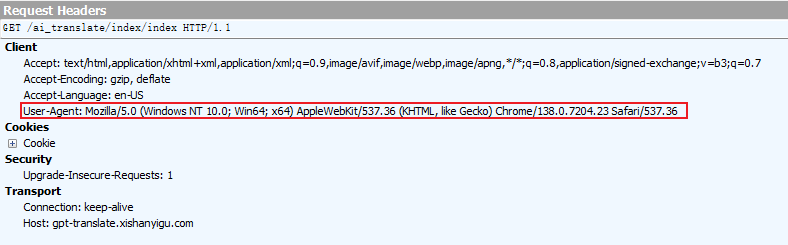
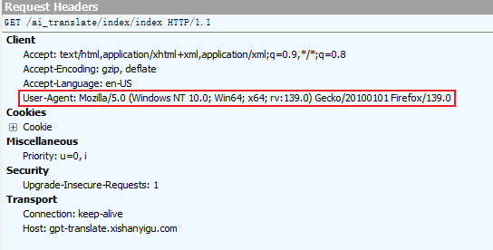
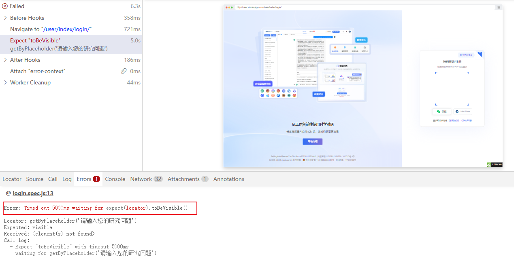
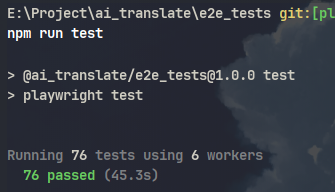
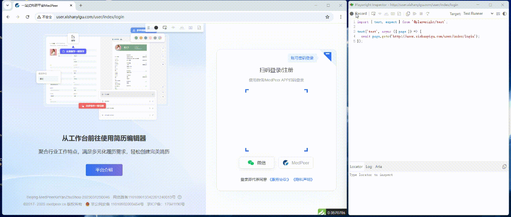
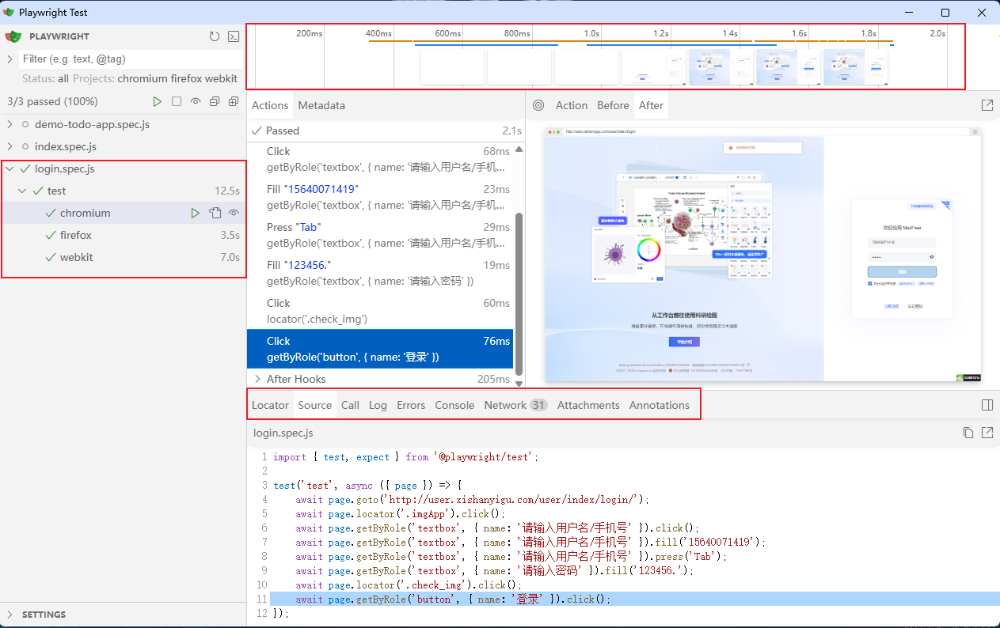

# 一、Playwright 简介

Playwright 是微软开发的一款开源自动化测试工具，主要用于 Web 应用的端到端测试。它支持所有现代渲染引擎，包括 Chromium、WebKit 和 Firefox，能够模拟真实用户在不同浏览器环境下的操作行为。

什么是端到端测试？端到端测试是一种软件测试方法，旨在从**用户的视角**模拟真实的业务场景，验证整个应用系统的流程是否能够正常运行，包括系统内部各组件、子系统之间的交互，以及与外部系统（如数据库、第三方 API等）的集成是否符合预期。

# 二、功能介绍

## 支持跨浏览器

Playwright 支持所有现代渲染引擎，包括 Chromium、WebKit 和 Firefox。**可以确保网站在各种浏览器环境下都能正常运行，避免因浏览器差异导致的功能问题。**

<br />

在配置文件中添加相关配置：

```javascript
// playwright.config.js
import { defineConfig, devices } from '@playwright/test';

export default defineConfig({
  // other config

  /* Configure projects for major browsers */
  projects: [
    { name: 'chromium', use: { ...devices['Desktop Chrome'] } },
    { name: 'firefox', use: { ...devices['Desktop Firefox'] } },
    { name: 'webkit', use: { ...devices['Desktop Safari'] } },
  ],
});
```

通过抓包工具查看请求的User-Agent可以发现使用了不同的浏览器引擎





## 支持自动等待

Playwright 在执行操作前会等待元素变得可交互，无需手动设置等待时间，**提高测试的稳定性**。

<br />

代码示例：

```javascript
import { test, expect } from '@playwright/test';

test('test', async ({ page }) => {
    await page.goto('http://www.xishanyigu.com/');
    await expect(page.getByPlaceholder('请输入您的研究问题')).toBeVisible();
});
```

运行结果：



## 内置并行运行

允许同时运行多个独立的测试用例，**缩短整体测试耗时**。

默认情况下，测试文件并行运行，文件内的测试用例是在同一个工作进程中按顺序运行。在配置文件中添加相关配置：

```javascript
// playwright.config.js
import { defineConfig } from '@playwright/test';

export default defineConfig({
  // other config

  /* Opt out of parallel tests on CI. */
  workers: process.env.CI ? 1 : undefined,
});
```

运行playwright执行测试，运行日志说明使用6个工作线程(默认CPU数量的一半)并行运行测试用例



## 强大的配套工具

包括可以录制操作生成对应测试代码的代码生成器，可以调试测试脚本的调试工具以及可以查看测试过程的追踪器，**为测试开发、执行及调试提供全流程支持**。

使用代码生成器录制登录流程并自动生成相关代码：




使用调试工具和跟踪器调试测试脚本：




# 三、与其他方案的对比

|需求/工具|Selenium|Cypress|Playwright|
|--|--|--|--|
|多浏览器|支持|否|支持|
|旧版浏览器|支持|否|否|
|多选项卡/多窗口|支持|需要插件支持|支持|
|性能|--|比Selenium快|比Selenium快|
|自动等待与重试|否|是|是|
|并行测试|通过Selenium Grid支持|需要付费服务|内置支持|
|社区|最广泛的社区支持|比Selenium小，比Playwright大|比Cypress、Selenium小|
|学习成本|高|低|低|
