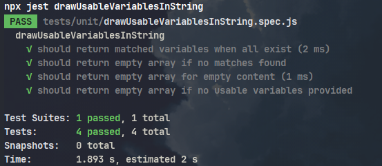
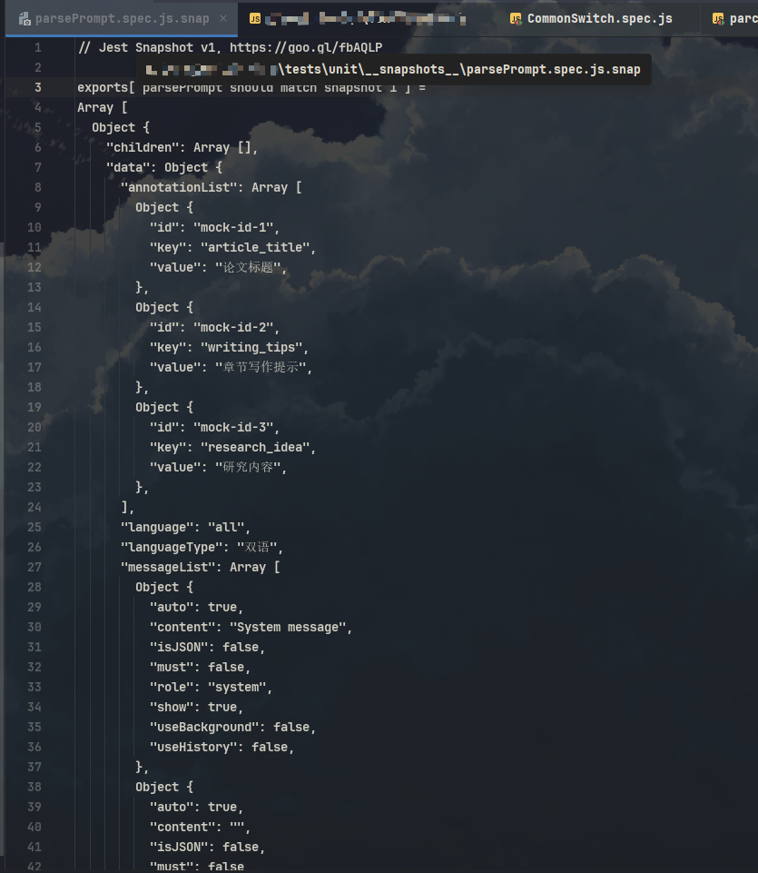
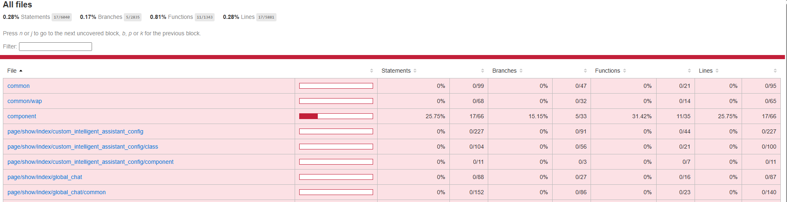
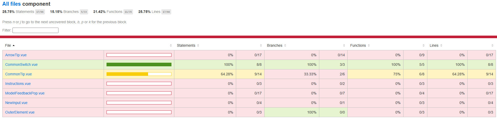
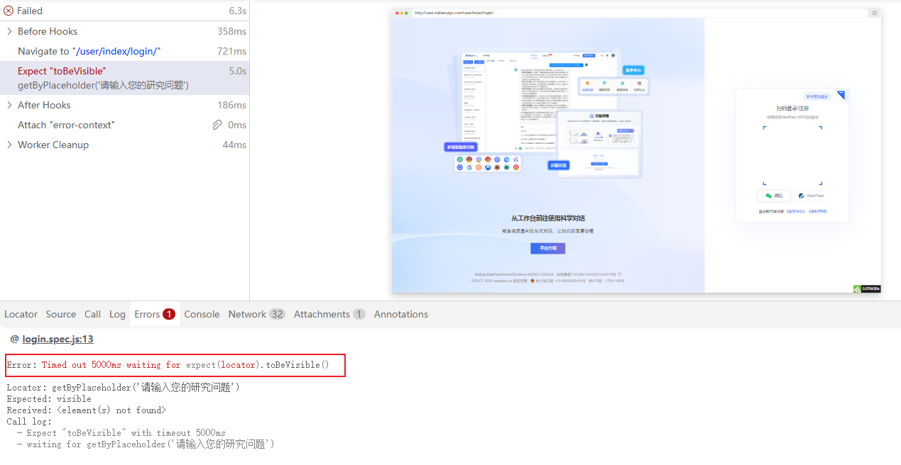
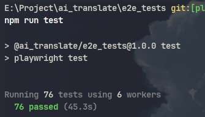

## 自动化测试定义及分类

自动化测试是指利用自动化工具执行测试用例、比较实际结果与预期结果、生成测试报告的过程。它能够减少人工干预，提高测试效率和准确性。

### 按测试粒度分类

1. **单元测试（Unit Testing）**
   - 测试最小可测试单元（通常是函数或方法），验证单个组件的功能正确性
   - 例如：解析Prompt转换为渲染使用的数据结构
   - 常用工具：Jest, Vitest

2. **集成测试（Integration Testing）**
   - 测试多个组件之间的交互，验证模块间接口的正确性
   - 例如：前端测试是否调用了接口，后端微服务间调用
   - 常用工具：Jest，Vitest

3. **端到端测试（End-to-End Testing）**
   - 模拟真实用户场景的完整流程测试，验证关键工作流程是否正常
   - 例如：用户注册，用户创建PDF翻译任务
   - 常用工具：Cypress, Selenium, Playwright

### 测试类型的比例

放一张测试金字塔的图片

参考比例为：

单元测试：占比约 70%
集成测试：占比约 20%
端到端测试：占比约 10%

在实际项目中，避免“唯比例论”，比例的核心是 “价值导向”，而非机械分配：

- 单元测试：覆盖 “高频变动的独立逻辑”（如工具函数、业务计算规则），避免过度测试简单逻辑（如 getter/setter）；
- 集成测试：覆盖 “关键协作点”（如接口调用、数据转换），避免重复测试单元已验证的逻辑；
- 端到端测试：只覆盖 “用户核心路径”（如注册 - 登录 - 支付），避免测试边缘流程（性价比低）。

## 自动化测试的成本与收益

成本
1. 测试工具的学习成本
2. 开发人员测试意识的培养：让项目变得更具可测试性(例如之前想测注册，但是验证码没有办法拿到所以测不了)
3. 首次适配项目的成本：封装公共能力，编写首批测试脚本
4. 测试用例的维护：新用例的编写成本，后续改版对旧用例的破坏
5. 局限：适用场景有限，并非所有测试都适合自动化(UI频繁变动，低频测试，主观性测试)；无法完全代替手工测试

收益
1. 对高频重复场景和大规模场景可以显著提升测试效率，降低重复劳动成本
2. 对核心逻辑编写对应的测试，保证后续添加新需求时不会影响旧功能
3. 支持持续集成，代码提交后自动执行测试并生成报告

## 测试工具 - Jest

### 简介

Jest 是 **Meta（Facebook）** 开发的一款开源 JavaScript 测试框架，主要用于单元测试和集成测试。它内置断言库、测试运行器和 mocking 功能，能够快速的编写自动化测试脚本。

### 功能介绍

#### 开箱即用的测试环境

- 极简配置：默认即可运行测试，也可通过配置文件进行配置。
- 内置断言库：提供丰富、可读性高的断言函数（`Jest Matchers`），支持链式调用。
- 内置测试运行器：支持按约定自动识别测试文件，并行执行测试、监视模式，可自动识别变更并仅运行相关测试。
- Mocking功能：可以模拟函数、模块、定时器、第三方库或 API 调用。用于隔离依赖、验证函数调用、控制被测代码的依赖行为。
- 快照测试：首次运行保存快照，后续比较差异。适用于测试 UI 组件输出、配置文件、数据结构等。
- 自动生成测试报告：内置集成 `Istanbul` 工具。可通过特殊标志生成测试报告，显示代码行、分支、函数、语句的覆盖情况。

#### 单元测试

1. 编写测试代码

```js
// 一个可以从字符串中提取 %(xx_xx)s 格式字符串并检查其是否在变量列表中的函数
import { drawUsableVariablesInString } from '../util';

describe('drawUsableVariablesInString', () => {
    // 准备测试用数据
    const usableVariables = [
        { key: 'name' },
        { key: 'age' }
    ];

    test('should return matched variables when all exist', () => {
        // 1. 准备测试数据
        const content = 'Hello, %(name)s! You are %(age)s years old.';
        // 2. 执行测试代码  
        const result = drawUsableVariablesInString(content, usableVariables);
        // 3. 断言执行结果
        expect(result).toEqual([usableVariables[0], usableVariables[1]]);
    });

    // 其他测试脚本
});
```

2. 运行测试查看运行结果

使用`npx jest`运行测试用例，可以看到以下结果：



从结果中我们可以看到测试运行器运行的测试用例及测试文件的数量，测试执行用时等信息。

#### Mock功能与快照测试

快照测试：首次运行测试时，Jest 会捕获被测对象的输出（如 UI 渲染结果、数据结构等），并将其保存在自动生成的 `.snap` 文件中作为“基准”。后续测试运行时，Jest 会将当前输出与快照文件比对，任何不一致都会导致测试失败。

适用场景：
- 输出结构稳定但内容复杂（如大段 HTML/XML，复杂对象等）
- 需要防止意外变更的配置对象

不适用场景：
- 包含动态数据（时间戳、随机 ID）
- 频繁变更的输出
- 简单的数值/布尔值断言

测试解析prompt，转换为渲染时需要的数据结构：

mock功能演示：parsePrompt中使用getUniqueID生成唯一ID，而 getUniqueID 生成的ID有随机数会导致测试结果不可控，因此需要mock getUniqueID的实现

```js
import { parsePrompt } from '../util';
import * as utils from '../getUniqueID';

// mock测试代码中对此模块的导入
jest.mock('../getUniqueID');

describe('parsePrompt', () => {
    let counter = 1;
    utils.getUniqueID.mockImplementation(() => `mock-id-${counter++}`);
    beforeEach(() => {
        // 重置计数器
        counter = 1;
    });
    // 测试脚本
});
```

快照测试演示：

想要验证输出的结构是否是预期的，如果使用断言需要编写大量的断言语句。

```js
// 测试单条数据的正常解析
it('should parse single prompt correctly', () => {
   const data = {
      "annotation": {
            "article_title": "论文标题",
            "writing_tips": "章节写作提示",
            "research_idea": "研究内容"
      },
      "preprocessing": {
            "writing_ideas": "%(writing_tips)s"
      },
      "prompt": [
            {
               "role": "system",
               "content": "System message"
            },
            {
               "role": "user",
               "content": "%(article_title)s%(writing_tips)s%(research_idea)s%(writing_ideas)s"
            }
      ],
      "module": "gen_research_ideas",
      "name": "AI本科毕业论文生成写作提示",
      "language": "all",
      "model": "default"
   };

   const result = parsePrompt(data, langList, modelList);

   // 验证基本结构
   expect(result).toHaveLength(1);
   const node = result[0];
   expect(node.title).toBe('AI本科毕业论文生成写作提示');
   expect(node.id).toBe('prompt0');

   // 验证 prompt 内容
   const prompt = node.data;
   expect(prompt.name).toBe('AI本科毕业论文生成写作提示');
   expect(prompt.module).toBe('gen_research_ideas');
   expect(prompt.language).toBe('all');
   expect(prompt.model).toBe('default');

   // 验证 messageList
   expect(prompt.messageList[0].content).toBe('System message');
   expect(prompt.messageList[4].content).toBe('%(article_title)s%(writing_tips)s%(research_idea)s%(writing_ideas)s');

   // 验证 annotationList
   expect(prompt.annotationList).toEqual([
      { id: 'mock-id-1', key: 'article_title', value: '论文标题' },
      { id: 'mock-id-2', key: 'writing_tips', value: '章节写作提示' },
      { id: 'mock-id-3', key: 'research_idea', value: '研究内容' },
   ]);

   // 验证 preprocessList
   expect(prompt.preprocessList).toEqual([{ id: 'mock-id-4', key: 'writing_ideas', value: '%(writing_tips)s' }]);
});
```

如果使用快照测试则直接断言快照即可。

```js
// 快照测试：验证完整输出结构
it('should match snapshot', () => {
   const data = {
      "annotation": {
            "article_title": "论文标题",
            "writing_tips": "章节写作提示",
            "research_idea": "研究内容"
      },
      "preprocessing": {
            "writing_ideas": "%(writing_tips)s"
      },
      "prompt": [
            {
               "role": "system",
               "content": "System message"
            },
            {
               "role": "user",
               "content": "%(article_title)s%(writing_tips)s%(research_idea)s%(writing_ideas)s"
            }
      ],
      "module": "gen_research_ideas",
      "name": "AI本科毕业论文生成写作提示",
      "language": "all",
      "model": "default"
   };

   const result = parsePrompt(data, langList, modelList);

   // 生成快照
   expect(result).toMatchSnapshot();
});
```

Jest生成的快照文件：



之后执行该快照测试时都会进行对比，如果预期结构发生变更，也可先运行该测试查看变更是否正确，然后使用`jest --updateSnapshot`更新快照。

#### 集成测试

测试AIGC的导出服务（一个Nest.js编写的Node.js后端项目）：

1. 准备测试环境

```js
// 测试所需的NestJS测试工具
import { Test, TestingModule } from '@nestjs/testing';
// 要测试的AIGC导出服务
import { ExportAIGCService } from '@app/export/export-aigc.service';
// AIGC导出服务依赖的浏览器服务
import { BrowserService } from '@app/browser/browser.service';
// AIGC导出服务使用的数据传输对象（DTO）
import { ExportAIGCReportDto } from '@app/export/dto/ExportAIGCReport.dto';

// 设置全局测试超时为60秒`（因为集成测试需要访问真实网络资源）
jest.setTimeout(60_000);

describe('ExportAIGCService', () => {
   // 准备测试环境
   let service: ExportAIGCService;
   let browserService: BrowserService;
   let module: TestingModule;
   
   // 在执行测试用例前执行，创建测试环境
   beforeAll(async () => {
      // 创建测试模块
      module = await Test.createTestingModule({
         providers: [ExportAIGCService, BrowserService],
      }).compile();
      // 从测试模块中获取AIGC导出服务实例和浏览器服务实例
      service = module.get<ExportAIGCService>(ExportAIGCService);
      browserService = module.get<BrowserService>(BrowserService);
      // 手动初始化浏览器池
      await (browserService as any).initPool();
   });
   // 在执行所有测试用例后执行，回收资源
   afterAll(async () => {
      // 如果浏览器池存在，进行清理工作
      const pool = (browserService as any).browserPool;
      if (pool) {
         await pool.drain();
         await pool.clear();
      }
      // 关闭测试模块，释放所有资源
      await module.close();
      // 恢复日志记录器的原始实现
      jest.restoreAllMocks();
   });
   // 测试脚本
});
```

2. 编写测试代码

```js
it('应该成功导出', async () => {
   // 1. 准备测试数据
   const dto: ExportAIGCReportDto = { taskId: 'ag250702144740050894819842' };
   // 2. 调用AIGC导出服务的方法
   const [result, error] = await service.exportAIGCReport(dto);
   // 3. 断言验证
   expect(error).toBeNull();  // 期望没有错误
   expect(typeof result).toBe('string');  // 期望结果是字符串
});
```

#### 组件测试

```js
// Vue.js 官方提供的用于测试 Vue 组件的工具库，可模拟组件渲染、用户交互等场景，简化组件测试流程
import { shallowMount } from '@vue/test-utils';
// 一个支持自定义激活颜色和宽高的开关组件
import CommonSwitch from '@/component/CommonSwitch';

describe('CommonSwitch.vue', () => {
    // 测试默认props
    it('使用默认props正确渲染', () => {
        const wrapper = shallowMount(CommonSwitch)
        expect(wrapper.props('value')).toBe(true)
        expect(wrapper.props('inactiveColor')).toBe('#C5C5C5')
    })

    // 测试自定义props
    it('使用自定义props正确渲染', () => {
        const wrapper = shallowMount(CommonSwitch, {
            propsData: {
                value: false,
                activeColor: '#000000',
                inactiveColor: '#FFFFFF'
            }
        })
        expect(wrapper.props('value')).toBe(false)
        expect(wrapper.props('activeColor')).toBe('#000000')
        expect(wrapper.props('inactiveColor')).toBe('#FFFFFF')
    })

    // 测试点击事件
    it('点击时正确触发事件和切换状态', async () => {
        const wrapper = shallowMount(CommonSwitch)
        await wrapper.trigger('click')

        // 验证事件触发
        expect(wrapper.emitted('input')).toBeTruthy()
        expect(wrapper.emitted('input')[0]).toEqual([false])
        expect(wrapper.emitted('change')).toBeTruthy()
        expect(wrapper.emitted('change')[0]).toEqual([false])
    })
});
```

#### 生成测试覆盖率报告

执行`npx jest --coverage`即可生成报告，打开测试报告如下：



报告显示了项目的总测试覆盖率中各个模块的测试覆盖率，点击components目录可查看该目录下的测试覆盖率：



### 其他方案

- JS：`Jest`（Webpack项目推荐），`Vitest`（Vite项目推荐），`Mocha`（库项目推荐）
- Python：`pytest`
- PHP：`PHPUnit`

## 端到端测试工具 - Playwright

### 简介

Playwright 是微软开发的一款开源自动化测试工具，主要用于 Web 应用的端到端测试。它支持所有现代渲染引擎，包括 Chromium、WebKit 和 Firefox，能够模拟真实用户在不同浏览器环境下的操作行为。

### 功能介绍

#### 支持跨浏览器

Playwright 支持所有现代渲染引擎，包括 Chromium、WebKit 和 Firefox。**可以确保网站在各种浏览器环境下都能正常运行，避免因浏览器差异导致的功能问题。**

<br />

在配置文件中添加相关配置：

```javascript
// playwright.config.js
import { defineConfig, devices } from '@playwright/test';

export default defineConfig({
  // other config

  /* Configure projects for major browsers */
  projects: [
    { name: 'chromium', use: { ...devices['Desktop Chrome'] } },
    { name: 'firefox', use: { ...devices['Desktop Firefox'] } },
    { name: 'webkit', use: { ...devices['Desktop Safari'] } },
  ],
});
```

通过抓包工具查看请求的User-Agent可以发现使用了不同的浏览器引擎


#### 支持自动等待

Playwright 在执行操作前会等待元素变得可交互，无需手动设置等待时间，**提高测试的稳定性**。

<br />

代码示例：

```javascript
import { test, expect } from '@playwright/test';

test('test', async ({ page }) => {
    await page.goto('http://www.xishanyigu.com/');
    await expect(page.getByPlaceholder('请输入您的研究问题')).toBeVisible();
});
```

运行结果：



#### 内置并行运行

允许同时运行多个独立的测试用例，**缩短整体测试耗时**。

默认情况下，测试文件并行运行，文件内的测试用例是在同一个工作进程中按顺序运行。在配置文件中添加相关配置：

```javascript
// playwright.config.js
import { defineConfig } from '@playwright/test';

export default defineConfig({
  // other config

  /* Opt out of parallel tests on CI. */
  workers: process.env.CI ? 1 : undefined,
});
```

运行playwright执行测试，运行日志说明使用6个工作线程(默认CPU数量的一半)并行运行测试用例



#### 强大的配套工具

包括可以录制操作生成对应测试代码的代码生成器，可以调试测试脚本的调试工具以及可以查看测试过程的追踪器，**为测试开发、执行及调试提供全流程支持**。

使用代码生成器录制登录流程并自动生成相关代码：


使用调试工具和跟踪器调试测试脚本：


### 编写一个端到端测试用例

要测试的功能：登录

1. 编写测试代码：使用之前生成的测试代码

```js
import { test, expect } from '@playwright/test';

test('test', async ({ page }) => {
    // 跳转到目标页面
    await page.goto('http://user.xishanyigu.com/user/index/login/');
    // 执行用户操作
    await page.locator('.imgApp').click();
    await page.getByRole('textbox', { name: '请输入用户名/手机号' }).click();
    await page.getByRole('textbox', { name: '请输入用户名/手机号' }).fill('15640071419');
    await page.getByRole('textbox', { name: '请输入用户名/手机号' }).press('Tab');
    await page.getByRole('textbox', { name: '请输入密码' }).fill('123456.');
    await page.locator('.check_img').click();
    await page.getByRole('button', { name: '登录' }).click();
    // 断言执行结果 
    await expect(page.getByPlaceholder('请输入您的研究问题')).toBeVisible();
});
```

2. 运行测试查看运行结果

使用`npx playwright test login`运行测试用例，可以看到以下结果：


### 其他方案

|需求/工具|Selenium|Cypress|Playwright|
|--|--|--|--|
|多浏览器|支持|否|支持|
|旧版浏览器|支持|否|否|
|多选项卡/多窗口|支持|需要插件支持|支持|
|性能|--|比Selenium快|比Selenium快|
|自动等待与重试|否|是|是|
|并行测试|通过Selenium Grid支持|需要付费服务|内置支持|
|社区|最广泛的社区支持|比Selenium小，比Playwright大|比Cypress、Selenium小|
|学习成本|高|低|低|
